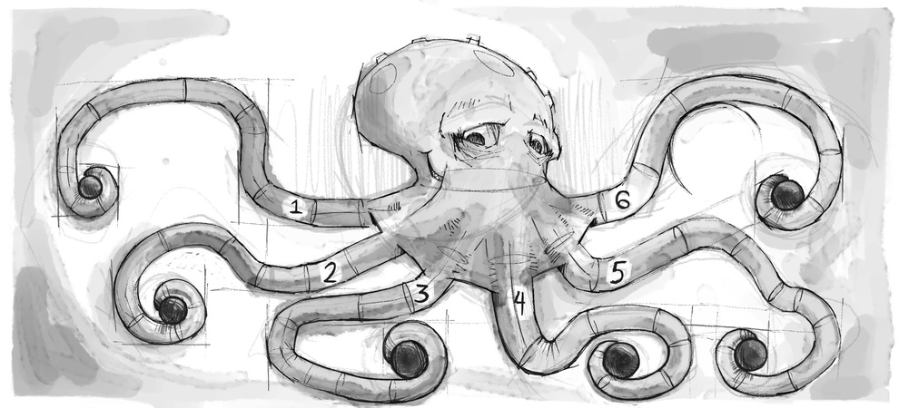

# Tablice i obiekty
Dzisiaj poznamy dwa bardzo ważne koncepty dla programowania w języku JavaScript - są to **tablice oraz obiekty**.

## Tablice
Tablice to po prostu zmienne, które mogą przechowywać wiele wartości.

## Zmienna
Jeżeli byłyście na warsztatach, to pewnie pamiętacie, że zmienna to taki schowek, do którego możemy włożyć jakąś wartość.


## Tablica
Tablica to taki zbiór schowków, z numerkami. Do każdego z nich też można włożyć jakąś wartość.


## Po co to?
Żeby w ładny sposób przechowywać wiele podobnych danych.

*Przykład: Jeżeli mamy 10 użytkowników na stronie, to znacznie łatwiej przechować ich imiona w jednej tablicy niż w 10 oddzielnych zmiennych.*

## Jak to wygląda?
Przypomnijmy sobie najpierw jak definiujemy zmienne:
```javascript
let name = "Kasia";
```
A tak wygląda tablica:
```javascript
let names = ["Kasia", "Basia", "Asia"];
```

lub tak:
```javascript
let names = [
  "Kasia",
  "Basia",
  "Asia"
];
```

### Jak odczytać wartość z tablicy?
Żeby odczytać wartość zmiennej wystarczy użyć jej nazwy. Na przykład, tak wypiszemy w konsoli pozdrowienia dla osoby ktorej imię zapisaliśmy w `name`:
```javascript
console.log( "Hej " + name + "!" );
```

Żeby odczytać element z tablicy, potrzebujemy użyć jej nazwy i numeru elementu:
```javascript
console.log( "Hej " + names[1] + "!" );
```

## Uwaga! Inne numerowanie ;)
W tablicach zaczynamy numerować od wartości 0:
```javascript
let names = [
  "Kasia", // To jest wartość o numerze 0
  "Basia", // To jest wartość o numerze 1
  "Asia"   // To jest wartość o numerze 2
];
```

# Do maszyn!

## Spróbujcie utworzyć tablicę w konsoli
- Otwórzcie przeglądarkę Chrome
- Otwórzcie narzędzia programistyczne *(F12 lub Cmd+Opt+I)*
- Zobaczcie, czy możecie utworzyć tablicę `names` jak z poprzednich slajdów, ale z 5 imionami.
- Spróbujcie wypisać kolejne elementy tej tablicy do konsoli, używając funkcji `console.log`

## Udało się?
Pewnie wyszło wam coś takiego?
```javascript
let names = ["Michał", "Jaromir", "Gracjan", "Hipolit", "Maksym"];

console.log(names[0]);
console.log(names[1]);
console.log(names[2]);
console.log(names[3]);
console.log(names[4]);
```

## Rozmiar tablicy
Tablica może mieć dowolną liczbę elementów.
Aby w dowolnym momencie sprawdzić, ile elementów zawiera, wystarczy użyć wartości `.length`
```javascript
console.log( names.length );
 wyświetli 5
```

## A co jeśli...
Będziemy mieli 100 użytkowników? Jak wypisać imiona wszystkich?
Nie ma sensu robić tego ręcznie, prawda?
Co nam pomoże?

## Pętle
Przypomnijmy sobie pętle z warsztatu.
```javascript
for (let i=0; i<10; i++) {
  // wykonaj ten kod tak długo jak warunek trwania pętli jest prawdziwy
}
```

### Spróbujcie wpisać w konsolę następujący kod:
```javascript
for (let i=0; i<5; i++) { 
    console.log(i);
}
```
Co wyszło?
```javascript
0
1
2
3
4
```

## Czas połączyć tablice i pętle
Używając pętli, wypiszcie wszystkie imiona.
Nie zapomnijcie o `names.length`!

### Wynik
```javascript
for (let i=0; i < names.length; i++) { console.log(names[i]) }
```

## Więcej zabawy z tablicami
Same, statyczne tablice są nudne.
Zabawa zaczyna się, kiedy dodajemy, usuwamy, lub modyfikujemy zawartość tablic.

## Dodawanie elementu
Poza własnością `length`, tablice mają różne metody, które pozwalają manipulować ich zawartością.

Przykładowo, aby dodać element na końcu tablicy, wystarczy użyć metody `push` 

```javascript
names.push("Jan")
```

## Dodawanie elementu
Spróbujcie dodać imię do naszej tablicy `names`, a następnie wypisać ją w pętli, jak przed chwilą.
Ponieważ w pętli używamy własności `length`, nie ma znaczenia, jak duża jest tablica, ani ile razy została zmieniona - zawsze wypiszemy wszystkie elementy.

## Więcej możliwości
`push` to nie jedyna metoda. Jest ich więcej, przykładowo
- `pop` - usuwa ostatni element
- `shift` - usuwa pierwszy element i przesuwa indeksy pozostałych elementów
- `unshift` - dodaje element jako pierwszy i przesuwa pozostałe indeksy
- `concat` - pozwala łączyć kilka tablic w jedną

Więcej metod znajdziecie [tu](https://developer.mozilla.org/en-US/docs/Web/JavaScript/Reference/Global_Objects/Array/prototype)

## Obiekty
Obiekty, podobnie jak tablice, są również zbiorami wartości. Z tym, że w obiektach każda wartość ma swoją nazwę.

## Przypadek z życia
Wyobraźcie sobie, że mamy wiele danych użytkownika: Imię, nazwisko, wiek, płeć, adres email, miasto itp...
Jak przechować je w kodzie?

### W osobnych zmiennych?
```javascript
let userFirstName = 'Ewa';
let userLastName = 'Kowalska';
let userAge = 27;
let userGender = 'k';
let userEmailAddress = 'ewa.kowalska@poczta.pl';
let userCity = 'Gdańsk';
// ...
```
Mało to przyjazne, prawda?

### Tablice?
```javascript
let user = [
  'Ewa', 'Kowalska', 27, 'k', 'ewa.kowalska@poczta.pl', 'Gdańsk'
];
```
To wygląda już lepiej, ale odczytywanie np. adresu email oznacza coś takiego:

```javascript
console.log( user[4] );
```
Pamiętanie numerków nie jest łatwe.

## Dlatego mamy obiekty

```javascript
let user = {
  firstName: 'Ewa',
  lastName: 'Kowalska',
  age: 27,
  gender: 'k',
  emailAddress: 'ewa.kowalska@poczta.pl',
  userCity: 'Gdańsk'
}
```
### A tak można odczytać wartość adresu email:

```javascript
console.log(user.emailAddress)
```
## Anatomia obiektów
```javascript
let user = { nazwa: 'wartość1', nazwa: 'wartość2'};
```

Porównajmy z tablicą
```javascript
let names = ["Asia", "Basia", "Kasia"]
```

## Wartości wewnątrz obiektów<
Aby dostać się do wartości używamy następującej notacji:
```javascript
user.nazwa;
```

Lub, podobnie jak w przypadku tablicy:
```javascript
user['nazwa'];
```
Ale ta notacja jest rzadziej używana, tylko w specyficznych przypadkach.

## Wartości wewnątrz obiektów
Nazywane są `własnościami` lub `polami` obiekt. W angielskiej nomenklaturze określa się je jako `properties`.

## Właściwości obiektów
Można powiedzieć, że właściwości obiektów są takimi zmiennymi wewnątrz obiektów

Pamiętacie, że zmienne mogą przyjmować dowolne wartości, w tym nawet funkcje?

## Funkcje wewnątrz obiektów
Funkcje wewnątrz obiektów nazywamy **metodami**. Tworzy się je tak:
```javascript
let myObject = {
  sayHi: function () {
    console.log('Hi!')
  }
}
```

A wywołuje tak:

```javascript
myObject.sayHi();
// Wypisze: Hi!
```
Ale o funkcjach innym razem :) Na następnym follow-upie zajmiemy się tematyką funkcji. Dziś wracamy do obiektów.

## Sprawdźmy obiekty w boju!


## Ćwiczenie
Paczkę z zadaniem znajdziecie [tutaj](./exercise.zip). Otwórzcie plik `exercise1.html`
### Strutkura
Plik wygląda z grubsza tak:
```html
<html>
<head>
...
</head>
<body>
    <div class="shelf"></div>
    <script type="text/javascript">
        // Miejsce na Twój skrypt
    </script>
</body>
</html>
```

## Sprawdźcie, co jest w przeglądarce.
Nic specjalnego.
To jest pusta półka na książki.

## Ale to nie wszystko.
Dodatkowo dostępna jest przygotowana funkcja `renderBook`, którą napisaliśmy dla Was.

Funkcja ta stworzy pojedynczą książkę i umieści ją na półce.

Funkcja `renderBook` przyjmuje jako jedyny argument obiekt, o następujących wartościach:
- `title` - tytuł
- `author` - autor
- `year` - rok wydania

## Zadanie
Używając naszej funkcji, dodajcie na półkę 5 dowolnych książek.

## Rozwiązanie
Pewnie wyszło Wam coś takiego:
```javascript
let book1 = {
  author: 'Janina Kowalska',
  title: 'Mój pamiętnik',
  year: 2017
};

renderBook(book1);
```
(i tak 5 razy)

## Prościej
Nie trzeba obiektu przypisywać do zmiennej.
Można go przekazać bezpośrednio:
```javascript
renderBook({
  author: 'Janina Kowalska',
  title: 'Mój pamiętnik',
  year: 2017
});
```

## To teraz łączymy


Obiekty i tablice razem.

## Przypomnijmy sobie
- W zmiennej można przechowywać tablicę albo obiekt
- Tablica to zbiór ponumerowanych zmiennych
- Obiekt to zbiór nazwanych zmiennych
więc...

## Możemy je zagnieżdżać w sobie
```javascript
let ultraArray = [
  [1, 2, 3],
  ['red', 'blue', 'green'],
  ['small', 'medium', 'big']
];
```


Aby dostać się do wartości:
```javascript
ultraArray[1][0] // 'red'
```

## Tablice w tablicy

Tablice w tablicy określa się mianem tablic dwuwymiarowych. Często spotyka się je w grach.
Doskonałym przykładem jest szachownica, gdzie położenie każdego pionka określone jest 2 współrzędnymi.

## Obiekty w tablicy
```javascript
let books = [
  {author: 'Douglas Adams', title: 'Hitchhickers ...', year: 1979},
  {author: 'Douglas Adams', title: 'Restaurant at ...', year: 1982},
  {author: 'Douglas Adams', title: 'Life, the Uni ...', year: 1985}
];
```

Aby dostać się do wartości:
```javascript
books[0].author // 'Douglas Adams'
```

## Obiekty w obiektach
let author = {
  name: 'Mario Puzo',
  books: {
    godfather1: 'The Godfather, part 1',
    godfather2: 'The Godfather, part 2',
    godfather3: 'The Godfather, part 3'
  }
}
Aby dostać się do wartości:
```javascript
author.books.godfather2; // The Godfather, part 2
```

## Tablice w obiektach
```javascript
let book = {
  name: 'Harry Potter',
  languages: ['en', 'ge', 'pl', 'fr', 'it']
}
```

Dobieramy się do wartości:
```javascript
book.languages[2] // 'pl'
```

## Tablice w obiektach
Pamiętajcie, że po tablicach wewnątrz obiektów najczęściej poruszamy się przy użyciu pętli.

Mając bardzo skomplikowane obiekty mogą powstać takie oto potworki:
```javascript
author.books.novels[17].translations[3].title
```

Dlatego czasem warto używać zmiennych po drodze:

```javascript
let novels = author.books.novels
let title = novels[17].translations[3].title
```

## Finalne zadanie


# Opis zadania
W dobrze nam znanym pliku `exercise1.html` mamy również dostępne bardziej skomplikowane dane pod zmienną `shelf`

Waszym zadaniem będzie napisanie kodu, który pobierze informacje o książkach ze zmiennej <code>shelf</code>, i użyje funkcji <code>renderBook</code> żeby umieścić te książki na naszej półce.

*Uwaga, nie wszystkie wartości z `shelf` muszą zostać użyte.*

Strukturę danych możecie podejrzeć w pliku `shelf.js` lub w konsoli przeglądarki poprzez wpisanie `shelf`.

Powodzenia!
Dzięki za wspólnie spędzony czas i do zobaczenia!